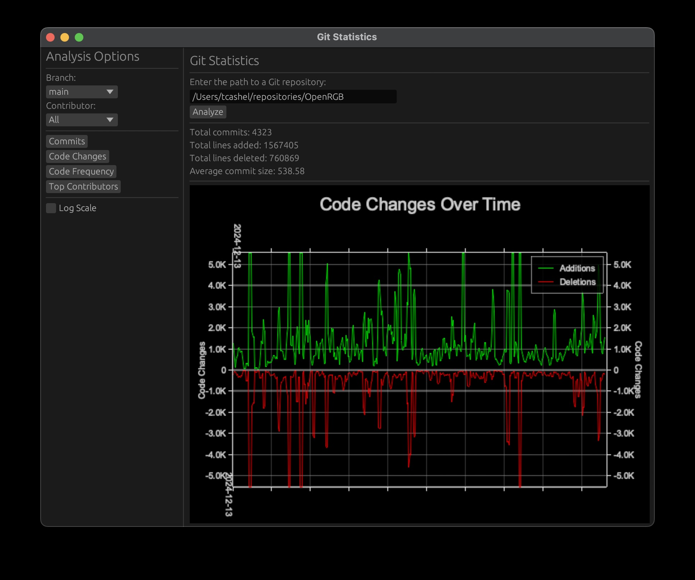

# GitStats

A modern, fast Git repository analyzer and visualization tool built in Rust.

[](https://opensource.org/licenses/MIT)

GitStats provides interactive visualizations and insights into your Git repositories, helping you understand commit patterns, code changes, and contributor dynamics.



## Features

- 📊 **Interactive Visualizations**: Beautiful, interactive charts showing commit activity, code changes, and contributor statistics
- 🔍 **Deep Repository Analysis**: Analyze commit patterns, code changes, and contributor dynamics
- 🌳 **Branch-Specific Analysis**: Filter analysis by specific branches
- 👥 **Contributor Insights**: Track individual contributor activity and impact
- ⚡ **High Performance**: Built in Rust for speed and efficiency
- 💾 **Smart Caching**: Caches analysis results for quick subsequent access
- 🎨 **Dark Mode**: Easy on the eyes with a modern dark theme
- 📈 **Adaptive Scaling**: Smart data aggregation for large repositories

## Installation

### From Source

```bash
# Clone the repository
git clone https://github.com/tcashel/gitstats.git
cd gitstats

# Build and install
cargo install --path .
```

### From Crates.io (Coming Soon)

```bash
cargo install gitstats
```

## Usage

1. Launch GitStats:

   ```bash
   gitstats
   ```

2. Enter the path to your Git repository
3. Select a branch and contributor to analyze
4. Choose from various visualization options:
   - Commit Activity
   - Code Changes
   - Contributor Statistics
   - Code Frequency

## Development

### Prerequisites

- Rust 1.83 or higher
- Git 2.39 or higher
- gnuplot (optional, for better benchmark visualizations)

  ```bash
  # macOS
  brew install gnuplot

  # Ubuntu/Debian
  sudo apt-get install gnuplot

  # Fedora
  sudo dnf install gnuplot
  ```

### Building

```bash
cargo build --release
```

### Running Tests

```bash
# Run unit tests
cargo test

# Run benchmarks
cargo bench

# Run specific benchmark group
cargo bench repository_analysis

# Run specific benchmark
cargo bench plot_commits
```

### Benchmarks

GitStats includes comprehensive benchmarks to measure and track performance:

- **Repository Analysis**
  - Full repository analysis
  - Filtered analysis (by contributor)
  - Branch-specific analysis

- **Data Processing**
  - Small dataset aggregation
  - Large dataset aggregation (10,000+ points)

- **Plotting Performance**
  - Commit visualization
  - Code changes visualization
  - Log scale plotting

- **Caching System**
  - Cache lookup performance

#### Benchmark Results

Benchmark results are generated using criterion.rs and include:

- Statistical analysis
- Performance graphs
- Historical comparisons
- HTML reports (in `target/criterion`)

More information can be found in the [benchmarks/README.md](benchmarks/README.md) file.

#### Tracking Performance Over Time

Criterion.rs automatically saves benchmark results and generates comparison reports. To track performance:

1. **Initial Setup**:

   ```bash
   # Run benchmarks to generate initial data
   cargo bench

   # Create benchmark directories
   mkdir -p benchmarks/baselines
   mkdir -p benchmarks/baseline

   # Save initial baseline
   cp -r target/criterion/* benchmarks/baselines/$(date +%Y%m%d)
   cp -r target/criterion/* benchmarks/baseline
   ```

2. **View Results**:
   ```bash
   # After running benchmarks, open the HTML report
   open target/criterion/report/index.html
   ```

3. **Track Changes**:
   - Latest results are in `target/criterion/`
   - Baselines are stored in `benchmarks/`
   - Each run compares against the baseline
   - Changes are highlighted with statistical significance

4. **Save New Baselines**:
   ```bash
   # Run the benchmarks
   cargo bench

   # Save as new baseline
   cp -r target/criterion/* benchmarks/baselines/$(date +%Y%m%d)
   cp -r target/criterion/* benchmarks/baseline
   ```

5. **Compare with Previous**:
   ```bash
   # Compare with saved baseline
   cargo bench -- --baseline benchmarks/baseline
   
   # Compare with specific historical baseline
   cargo bench -- --baseline benchmarks/baselines/20231201
   ```

6. **Continuous Integration**:
   - The CI workflow includes benchmark runs
   - Results are compared against the main branch baseline
   - Performance regressions are flagged in PR reviews
   - Baselines are stored in the repository under `benchmarks/`

### Generate Documentation

```bash
cargo doc --no-deps --open
```

## Contributing

Contributions are welcome! Please feel free to submit a Pull Request. For major changes, please open an issue first to discuss what you would like to change.

1. Fork the repository
2. Create your feature branch (`git checkout -b feature/AmazingFeature`)
3. Commit your changes (`git commit -m 'Add some AmazingFeature'`)
4. Push to the branch (`git push origin feature/AmazingFeature`)
5. Open a Pull Request

Please make sure to update tests and benchmarks as appropriate.

## License

This project is licensed under the MIT License - see the [LICENSE](LICENSE) file for details.

## Acknowledgments

- Built with [egui](https://github.com/emilk/egui) for the UI
- Uses [git2-rs](https://github.com/rust-lang/git2-rs) for Git operations
- Visualization powered by [plotters](https://github.com/plotters-rs/plotters)
- Benchmarking with [criterion.rs](https://github.com/bheisler/criterion.rs)
- Performance visualization with [gnuplot](http://www.gnuplot.info/)

## Project Status

GitStats is under active development. We welcome feedback, bug reports, and contributions from the community.

## Contact

- Create an issue: [https://github.com/tcashel/gitstats/issues](https://github.com/tcashel/gitstats/issues)

